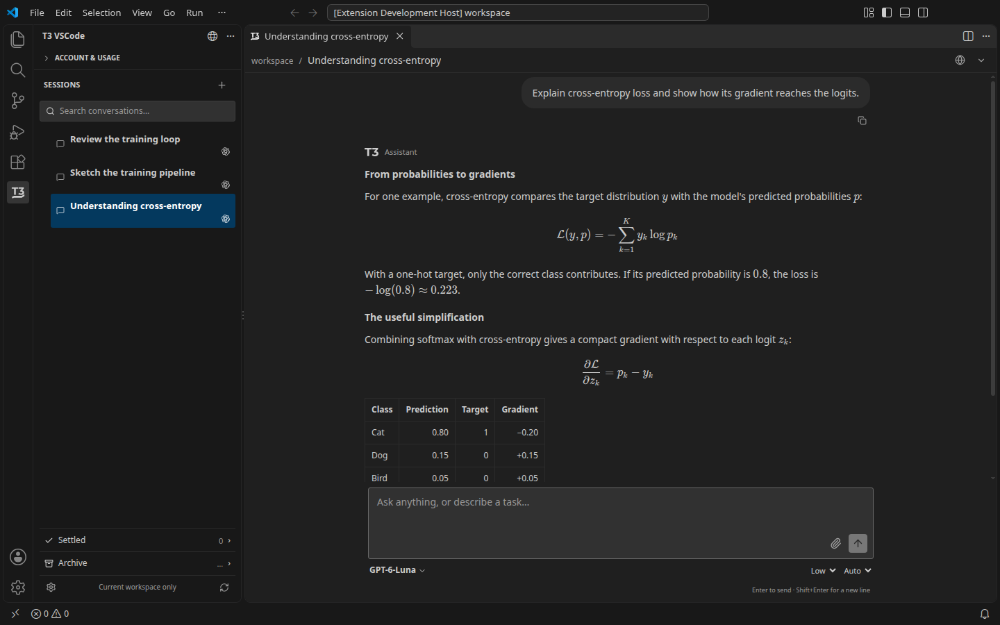
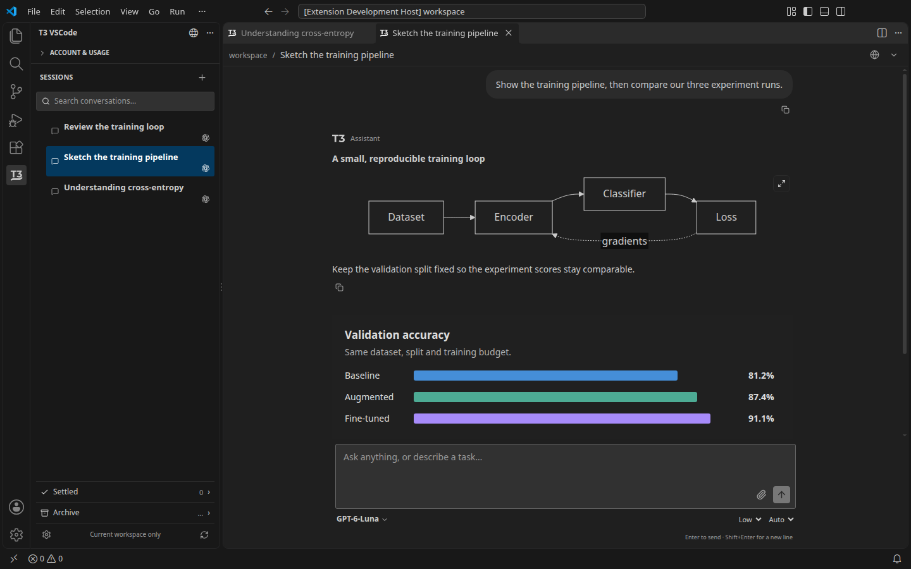
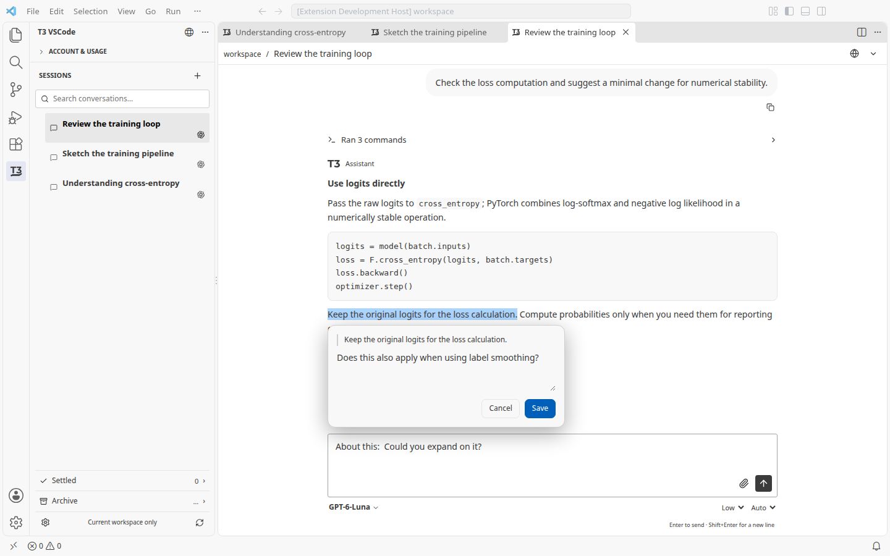

# T3 VSCode

**Local alpha preview — 0.1.13.** The published prerelease remains 0.1.12 on the [VS Code Marketplace](https://marketplace.visualstudio.com/items?itemName=hungtienhuang.t3-vscode). Install this preview from a local VSIX.

A VS Code client for a separately running [T3 Code](https://github.com/pingdotgg/t3code) server. T3 VSCode adds a workspace session manager and chat in editor tabs. Colors follow your VS Code theme; the extension host owns connection, authentication and shared conversation state.

## In the editor

Actual extension screenshots, captured in an isolated VS Code window with sample conversations.

**Sessions beside readable equations and tables.** Chat lives in editor tabs; Account & Usage stays collapsed until you need it.



**Diagrams and interactive graphics in the conversation.** Mermaid and T3 HTML visuals render alongside the explanation.



**Quote a specific passage and add a comment.** The reference goes at your prompt cursor, while commands stay inside a collapsed summary.



## Get started

Linux is the first verified platform. Install T3 Code separately using its [installation guide](https://github.com/pingdotgg/t3code/blob/main/docs/user/install.md), then start its server. On Linux or macOS, `t3 service install` installs and starts the background service; see the [service instructions](https://github.com/pingdotgg/t3code/blob/main/docs/user/background-service.md). To run manually, keep `t3 serve` running in a terminal. T3 VSCode discovers and pairs with the local server. Remote T3 servers are not supported yet.

When no local server is found, the extension shows installation links, service and manual commands, Retry connection and native Settings. Leave **T3 VSCode: T3 Home** empty for the default T3 home, or set it to your server’s data directory. Settings live in **Preferences → Settings → Extensions → T3 VSCode**, grouped under **Appearance**, **Reading**, **Usage** and **Connection**; existing setting keys and saved values are preserved.

The sidebar manages sessions. **Account & Usage** starts collapsed, and **Settled** and **Archive** have separate lists. Expand Account & Usage to refresh limits and see the selected account’s reported update time. Select a session to open its editor tab; if it is already open, the extension reveals that tab. Use VS Code’s editor groups, group locking and tab/window movement to arrange chat beside your code. The globe opens the current session in your default browser, using localhost for a loopback server so it can reuse your paired browser session. Working sessions show a static icon and elapsed minutes; Input/Approval badges and VS Code notifications highlight sessions needing a response.

The status bar shows a small provider icon followed by reported month/week/session percentages, such as `M 72% · W 77% · S 94%`. Unreported windows are omitted; a single window uses its full name, such as `Week 77%`, and no reported windows show `Usage unavailable`. Hover for all windows and reset times, or click to expand Account & Usage for that account. Use the Command Palette’s **T3 VSCode: Configure Status Meters** command or **Status meters…** in Account & Usage to follow the focused chat and/or pin individual accounts. Shared credentials are deduplicated; separate subscriptions keep separate meters.

## Using T3 VSCode

Open the **T3 VSCode** activity bar view. **T3 VSCode: Open Chat in Editor Tab** opens the same app in an editor. With a folder open, only projects whose workspace root matches that folder and their threads appear, including archived conversations. Multi-root workspaces include each opened folder. An empty VS Code window can browse all server projects and use **No project** when the server supports it. New threads use an opened folder, or the selected project when there is no workspace.

The sidebar title keeps **Open Web UI** and its overflow actions. Use the single **New Thread** button above search to create an editor chat; right-click a session to rename, pin, settle, archive, restore or delete it. The editor has its conversation breadcrumb, browser shortcut and thread actions.

Each editor tab retains its conversation and draft. Session selection and input notifications reveal an already open conversation instead of duplicating its tab. Creating another conversation leaves existing editor drafts intact. Double-click the chat header title to rename a conversation. Tab titles follow conversation names and live renames; closing a tab keeps conversations running in other views.

Sessions begin directly below search, with one New Thread button in the Sessions heading and no project-name row. Subagents appear beneath their parent session in a tree whose branches start collapsed. Expand a parent to inspect its children. Active, Settled and Archive retain separate trees; a parent shown only as context is labeled **Parent session**. Search expands the ancestors of matching children. Hover or focus a subagent transcript row for its provider, model, current status and elapsed time; click it to open the child, then use **Subagent of** to return. Provider-native child conversations are read-only; T3-owned delegated conversations accept follow-ups.

Closing a newly created chat without typing, adding a reference/attachment or sending a message removes that untouched empty conversation after its last chat surface closes. Typing and later clearing still preserves it, as does managing the thread or renaming/pinning it in the Web UI. Preexisting empty conversations stay available.

Use **Fork** below a completed assistant response to continue from that point in a new conversation. The fork opens in that view and preserves the source conversation; the button is available when T3 supports native forking or its portable history fallback. File links in chat open a native VS Code editor, including links to a line or range such as `src/main.ts#L24-L25`.

Open **Settings → Extensions → T3 VSCode → Appearance** to change the three font sizes. The settings button at the bottom of the session manager and **T3 VSCode: Font Settings** command open that native settings page. **Interface** scales chat text and navigation (12–20 px, default 16); **Prompt** changes message input (12–20 px, default 14); **Code** changes code blocks, diffs and tool output (10–18 px, default 13). Changes apply immediately to every view and preserve conversations and drafts. Use the native User/Workspace tabs to choose where values are saved, and each setting's **Reset Setting** action to restore its default.

Use the message rail to preview and jump through past prompts and responses with the pointer, mouse wheel or keyboard. **Latest** returns to the live end. **T3 VSCode: Message Navigation** in native Settings offers **Left**, **Right** and **Off**, with Left as the default. Jumps are instant and preserve the composer draft; returning to the bottom resumes following streamed replies.

Chat stays in one virtualized column at every editor size; the two-column experiment has been removed for performance. Wide equations scroll horizontally and open a floating preview by click or keyboard, with LaTeX and MathML copy actions on right-click.

Chat and command text use the theme's editor foreground for stronger contrast, while secondary labels retain the theme's secondary color. Thought process entries start collapsed; consecutive commands and tool activity appear inside a closed summary that you can expand for details.

Paste an image into the message box, drag files onto it, or use its paperclip to choose files from anywhere on the local machine. Image thumbnails appear in drafts and sent messages. Paste, drop and file selection insert a stable image/file reference at the cursor so the provider receives its position in the paragraph. Click an image thumbnail or its inline reference for a floating preview. Attachments can be sent without additional text and remain attached through Queue and Steer. T3's attachment limits apply, and a failed upload must be removed and attached again before sending.

Markdown images, video/audio, Mermaid diagrams and T3's `html_render` graphics render inside the transcript. HTML graphics keep their interactions and adapt to the native theme inside a sandbox. Inline math supports `$...$` or `\(...\)`; display math supports `$$...$$` or `\[...\]`, including matrices and aligned equations. Wide display equations scroll horizontally inside the message; click or keyboard-activate an equation for a floating preview. Right-click a rendered equation to copy **LaTeX**, **LaTeX with delimiters**, or **MathML**; MathML is useful for equation editors. Math fonts and the diagram renderer ship locally with the extension.

Select text in a file and press **Ctrl+K** (**Cmd+K** on macOS), or choose **Reference Editor Selection** from its context menu, to insert a compact reference such as `@README.md:43-46` at the last-used chat’s prompt cursor. **Alt+K** remains available. The shortcut preserves existing prompt text and includes the exact selected text, including unsaved changes, when you send; removing the inline reference omits its snapshot. If no chat is open, the shortcut opens an editor chat; browsing sidebar usage preserves the last focused editor target. Select text in an assistant response and choose **Cite** to insert its reference at the last cursor position in your prompt, replacing selected prompt text when present. Add an optional comment, then click the inline reference or its quote chip to edit it; **Alt+Enter** opens the reference at the cursor. Removing the quote chip also removes its inline references, and deleting an inline reference prevents that quote from being sent. Quotes keep their T3 source link and readable text when sent; saved source links can reopen and highlight the response. References and drafts stay with their own conversation and view.

The model picker browses configured provider instances and Favorites. Search finds models across every provider using T3's fuzzy matching, and stars save favorites across extension sessions. Arrow keys navigate results; Enter chooses a model and Escape closes the picker. The middle composer control selects the model's advertised effort levels; models without that capability omit it. The visible Code/Plan toggle has been removed.

Type `/` for the current provider's commands and skills, or `@` to find files in the conversation's workspace. Arrow keys navigate suggestions; Enter or Tab inserts one. `/model` opens model search, and `/usage-limits` expands **Account & Usage** in the session manager for that provider.

While an agent is responding, **Enter** or the send button queues a follow-up after its turn. **Ctrl+Enter** (Cmd+Enter on macOS) steers the running turn when supported; otherwise the message queues. When the agent is idle, Enter sends normally. **Shift+Enter** inserts a new line. Queued messages and the current turn's task plan appear above the input. You can edit or cancel queued messages, reorder them by dragging or using the handle's arrow keys, and promote one to Steer. Stopping generation pauses the queue; **Resume queue** continues it.

Expand a turn's changed-file summary to browse folders and additions/deletions. Clicking a file opens VS Code's read-only diff editor for that turn's saved before/after snapshots. Earlier turn diffs remain unchanged by later edits or commits. This uses checkpoint files in the local T3 workspace; binary files cannot be expanded as text.

## Find in the current session

Click **Find in session** or press **Ctrl/Cmd+F** inside a chat to search its complete recorded text. Match case, Whole word and Messages only / All text filters help narrow results; Enter, F3 and the arrow buttons step through occurrences. Search scans older history, reveals matching collapsed activity and keeps the draft intact. LaTeX source and attachment filenames are searchable; image pixels and the contents of embedded HTML pages are not. Very broad searches retain up to 20,000 navigable matches and show the total count.

## Install a local VSIX

For building from source, see [Development and testing](docs/development.md#build-a-vsix).

In the VS Code window/profile where you want to use it, open **Extensions → ⋯ → Install from VSIX…**, choose that file, then reload the window if prompted. For an isolated preview installation, the CLI example uses separate user, extension and shared storage:

```sh
code --user-data-dir /tmp/t3-vscode-preview/user-data --extensions-dir /tmp/t3-vscode-preview/extensions --shared-data-dir /tmp/t3-vscode-preview/shared-data --install-extension ./target-installer/t3-vscode-0.1.13.vsix
```

The installed extension normally discovers your already-running T3 service under `~/.t3`. Leave **T3 VSCode: T3 Home** empty to use that default; an explicit setting or `T3CODE_HOME` overrides it. Packaging does not install the extension or start a server.

## Current scope

The core chat migration supports projects/threads, server-advertised models (including ACP instances), effort and permissions, file references, native editor links, assistant citations with comments, native font settings, message streaming, rich turn items, approvals, questions, Stop, progressive history, context-menu thread management, response forks and local VSIX packaging. Account limits, per-account status meters, session status notifications, native theme colors and missing-server setup are included. Clipboard/file attachments, authenticated inline media, interactive HTML, Mermaid, KaTeX with copy actions, nested subagents and message navigation are included. Full-session search and double-click renaming are included in v0.1.13. Terminal/preview panels, checkpoint restore and cross-window movement remain later work; specialized tool previews still need a fidelity pass. ACP model selection is covered by fixtures; the isolated live-server checks used Codex.

T3 VSCode uses the [MIT license](LICENSE); T3-derived code retains [the upstream notice](vendor/LICENSE.t3code), and bundled dependencies retain their own notices.

See [the publishing guide](docs/publishing.md) for the version policy, publisher setup and alpha release procedure; [SUPPORT.md](SUPPORT.md) explains bug reports.

Development setup, F5 debugging, automated checks and the source map are in [Development and testing](docs/development.md).
